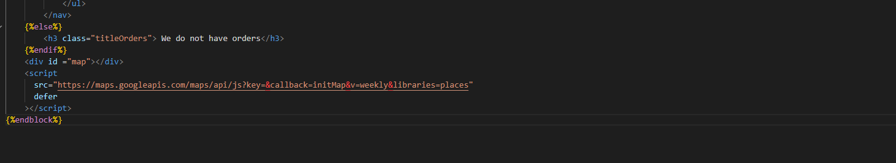
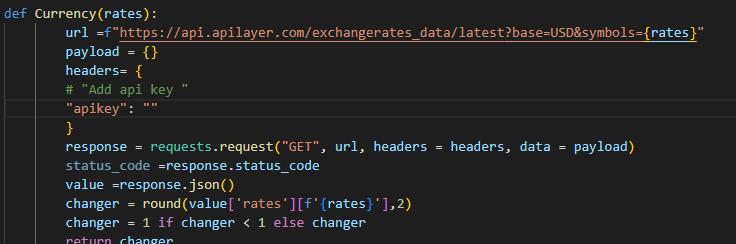
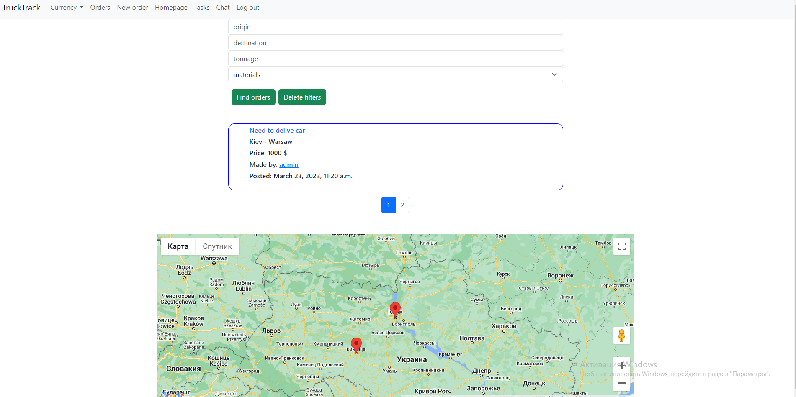
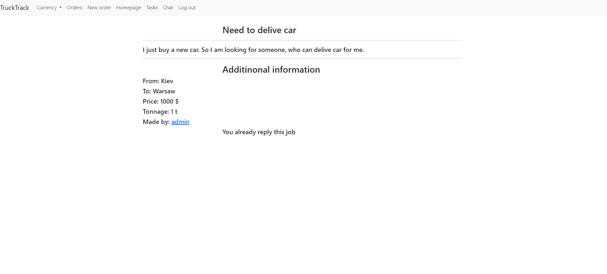
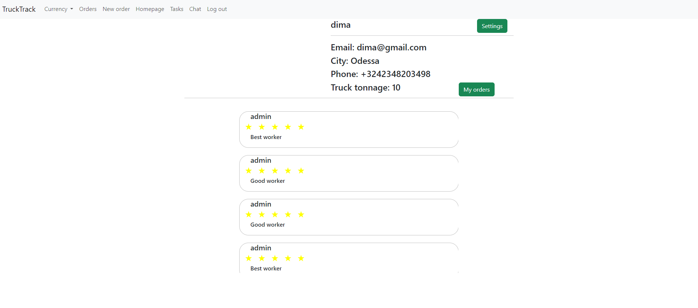
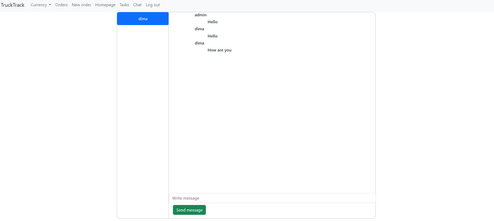

## Trucktrack project
### Video demo: <https://youtu.be/KtpYw0JzpBg>
___

## What is the project about and its uniqueness
#### The main idea of this project it work as freelance platform, which can help peoples or companies to find peoples, 
#### who can delive something from point A to point B and who have own car or truck or etc.
#### All orders display on map so if you are freelancer you can choose any order by choosing the city you need and the route that will be convenient for you
#### You will also be able to choose an order where you can take an additional shipment to your initial order, knowing the path that you have to take during the execution of the first order using some filters which display on main page.
#### You will also be able to communicate with the customer or with the order executor through the chat built into this site, which will facilitate the execution of your order and, in case of certain problems, inform the customer about it
___

## Distinctiveness and Complexity
#### The complexity of the project is that the project works with the google maps API, which expands the functionality of the project and allows not only to create tasks and communicate with the person who will perform this task, but also to build an order route. That will allow the executors of this task to choose the optimal route, as well as, if possible (if there is a free seat in the car), to additionally choose an order according to the first route.
#### An important addition to this site is a chat that allows two users to communicate with each other, this chat receives a unique random number, that is, chats will not be repeated.
#### A money exchange API was also added for convenience. That will allow you to change the currency as needed.
#### In addition, you should mark the rating in which you can set the required number of stars, which makes the interface more user friendly.
#### This site is fully adoptive so you can use any device, which you want.
___
## Requirements
### First of all you need to get api from google maps:
#### Link this api: https://developers.google.com/maps?hl=ru
#### After that you need to add it into "trucktrack/templates/index.html" in script as on picture with "key=API":

### After that you need to get money exchange api:
#### Link on this api:<https://exchangeratesapi.io>
#### After that you need to add api to "trucktrack/views.py" in Currency function as on picture:

### After that you need to install all packeges from 'requirements.txt'
___

## Technologies, which I used in this project:
* Python with Django framework and Django REST framework 
* Javascript
* HTML
* CSS
____
## Index page 
#### on index page you can see:
* All orders which was create before 
* Filters, which give you a possibility to sort your orders for origin, destination, tonnage and type of your order
* Map where you can see all orders and them routes

____

## Order page
#### On order page you can:
* See additional information about your order
* If you not owner of this order and you tonnage give you possibility to give that order, you will have reply button(that give you a possibility to get this order).
* If you owner of this post, you can start work,choosing some freelancers, or delete order if work was finished.

____

## Homepage
#### On homepage you can:
* Choose settings(adding some phone number, city and truck tonnage)
* Add some rating to other users(adding stars and cooments)
* Send message to other users
* See all orders which you create before

#### Homepage use javascripte to create more interactive page, which add some information using fetch requests.
____

## Chat
#### On chat page you can communicate with other peoples

____

## Description of all files 
### The main app it is trucktrack where situated all files which i create.
___

### In models.py i create models, which describe:
* User, to be able to register a new user, as well as additional information (phone number, city and tonnage of the car)
* Orders that describe all the information on the request header, text describing additional information, the cities of sending and receiving the order, as well as the price, tonnage, as well as visibility and the performer. The last two points are needed so that when the owner of the post of performer chooses, the order becomes invisible for other users, and the user who will perform this task received it among his tasks.
* All cities from orders will be added to the city model, from where they will be added to orders using foreign keys. Which makes it possible to reduce the order table.
* In type model, also expands the possibilities of orders, which allows you to add a type of cargo.
* In the Performers model, you can add performer to orders, which will allow you to choose one performer among many performers in the future.
* The Grade model allows the user to add a rating from 1-5 and also write comments.
* The Chat and Chats model allows you to create a chat between two users by adding a random number to the chats, which will be used in the chat model, where all messages made by a certain user are recorded, as well as a link to the chat number and the time when it was made.
___

### In forms.py i create modelform which i used in create order page. This form use title,text,bid and tonnage this is a part of field which i use to create new order page.
___

### In serializer.py i serialize my Order,Grade, Chat and Performers models which allows me to make jsonresponse to my page, so i can make my site more interactive,using javascript.For field which used foreignkey to another models i used slugrelatedfield.Serializers it is part of Django Rest Framework which make using jsonresponse more simplier.
___

### In urls.py i display all urls which i need to my site.
___

### In views.py i use:
* Currency function which add possibility to change value of money in my page.Using money exchange API.This function i use in index function.
* Index function it is the main page on my site which present all orders and give possibillity to filter orders using some parameters (which you can add in filters form).This function return values from order, curency to index.html.
* Register, logining and logouting function allow to create new user and add this user to User model. In logining you can login as user, if you pass authenticate.So this function allow to sign as some user if this user exists.Loginouting function just log out user from site.
* In neworder function you can add some order using  create_order.html. You just get POST request from form in create_order.html. And add cities to Cities model and all other to Orders model. it allow to create new order.
* Orders_map function get information from orders and send it to index.js using jsonresponse, which allow to create some points in map,build roadmap and add some description to orders.And have POST method which add some filters to our map. 
* Order function get infromation about order which we choose in our url or click on this order in main(index.page). This function also have post, put and delete requests which allow to add performer for this order, or delete it performer, or choose performer from performers if you are owner of this order.
* Orderstart function return jsonresponse to order.js with performers data. I made it because i need more interactive page. So if you want to change worker it return form with selection all performers which reply to this order. And you don't need to update page for this things.
* Profile_page function return information about user,which you write in url. Also it have put and post methods. Put method allow to add some phone number, city and car tonnage to User model.Post method need to create new chat between two users, and send first message.
* My_orders function return orders where user is selected as performer to my_orders.html
* Profile_orders function return orders where user is owner and send jsonresponse to profile.js where you can on my orders and see all orders, which you create before. It make site more interactive
* Rating function return jsonresponse to profile.js too. It return information about user in Grade model(comments, comentator, grade). Also this function have post method, which allow to add new comments in Grade model.
* Chat function return information about chats which you have for that moment.It return data to chat.html
* Chats function return jsonresponse to chat.js with all messages which you make on chat which you choose in chat.html. Also it have post method which allow to add new message to this chat.
____

## Javascript files:
### index.js file include interation with google maps:
* SubmitForm which add some filter to orders_map function which allow to return only that markers which you need.
* InitMap function its function which help to init my map and add some markers to this map according to data which i get from orders_map function in view.py. The constraction of this function i find in googlemaps API documentation, but write algoritm to create markers which use date from my site.
### chat.js file include Openchat function which send fetch request to chats in view.py and get information about all messages which have clicked chat.
### order.js file include customerStart,customerDelete,CustomerChange,customerReply function which:
* customerStart send fetch request to order in view.py and allow to choose performer for this task. Also this function add new buttons change and delete which you can use.
* customerReply send fetch request with put method to order in view.py to add user as performer to this task.
* customerChange send fetch request to order in view.py with POST method to make viasbility true, and fetch request to orderstart to interactive create selection form.It used when owner user push change worker button
* customerDelete send fetch request with delete method to order in view.py to delete this order.
### profile.js include function which allow:
* Add some comment and choose rating and send fetch request to rating function in view.py.
* addSettings which give posibilty to create new form which allow to send fetch request with POST method to profile_page in views.py using confirmChanges function
* chatting function which create form where you can create chat and send first message to another user, using fetch request with PUT method to profile_page in views.py using SendMessage function.
* toProfile function  which return your main profile.html
* MyOrders function which send fetch request to profile_orders in views.py and get all post which you create before.

___

## Templates html and css files
### layout.html it is the main html file all other files extends from this file it include navbar which i create using bootstrap with links to all pages which we have.
### chat.html and chat.css. Chat.html have blocks with all chats which we have for now? which we get from chat in views.py. All others features create by chat.js.In Chat.css situated all appearance of chat.html page for all block and chats. Also it contain media for creatings adoptivity to this site.
### create_order.html and create-order contain form which help us to create new order and sent information to neworder function. Create-order.css include appearance of main block which include form(form use bootstrap classes to make it more prettier). Also it have media too.
### index.html and index.css.Index.html include:
* Filters form which allow to send some filters to index function in view.py.
* Blocks, with orders, which we create with using django-template, which we get from index function.
* Pagination with buttons which we create in index function and create buttons using bootstrap.
* Map which we create using google maps Api https://maps.googleapis.com/maps/api/js?key=&callback=initMap&v=weekly&libraries=places to import map into our site and index.js where we create some markers, according to orders which we create before. 
### Index.css include appearance to all blocks in this page and media for adoptivity.
### login.html,register.html and registration.css include forms for logining and registation which send POST request to logining and register user. Registration.css contain appearance for blocks which include forms(for forms i use bootstrap classes) and media for adoptivity.
### my_orders.html and myorders.css.My_orders.html include blocks which i create using django-templates with all information from orders where user is performer. Myorders.css have appearance to blocks with orders and media for creating adoptivity.
### order.html and order.css.Order.html include iformation about order which we get from order function in view.py. Also it have button to reply if you are not owner of this order and selection form if you are owner of this order.All others button create in order.js. Order.css have appearance to order view and media for adaptivity.
### profile.html anad profile.css.Profile.html include information about user, which we get from profile_page function in views.py, user rating which we get from ratings function. Also we have settings, myorders, send message buttons which we can click and get some actions usings profile.js. Profile css contain appearance for profile_page and media for adoptivity.
